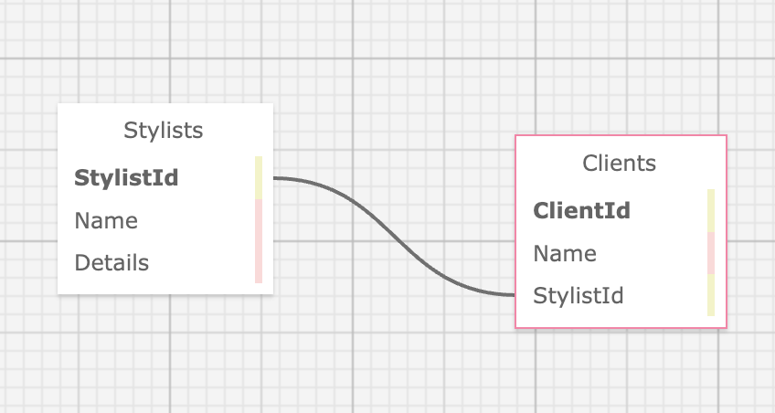

# _Hair Salon_

#### By Noah Atkinson

#### _A web application to help Clarie (salon owner) manage her employees (stylists) and their clients._

## Technologies Used

* _C#_
* _.NET_
* _MVC_
* _SQL Workbench_
* _Entity Framework_

## Setup/Installation Requirements



* _Clone this repo._
* _Open your terminal (e.g., Terminal or GitBash) and navigate to this project's production directory called "HairSalon"._
* _This program was built using `Microsoft .NET SDK 6.0`, and may not be compatible with other versions._
*  _Open the browser to [https://localhost:5001]. If you cannot access localhost:5001 it is likely because you have not configured a .NET developer security certificate for HTTPS. To learn about this, visit: [Redirecting to HTTPS and Issuing a Security Certificate.](https://www.learnhowtoprogram.com/c-and-net/basic-web-applications/redirecting-to-https-and-issuing-a-security-certificate)_

## SQL Workbench Configuration
* _Create an `appsetting.json` file in the "HairSalon" directory of the project._
* _Within `appsettings.json`, put in the following code, replacing the `uid` and `pwd` values with your own username and password for MySQL. Be sure to exclude the brackets as well_ 
```json
{
    "ConnectionStrings": {
        "DefaultConnection": "Server=localhost;Port=3306;database=hair_salon;uid=[YOUR-USERNAME-HERE];pwd=[YOUR-PASSWORD-HERE];"
    }
}
```
* _If you'd like to push this cloned project to a public-facing repository, remember to add the appsettings.json file to your .gitignore first._
* _Once "appsettings.json" file has been created, navigate back to SQL Workbench._ 
* _Import the database named ``"noah_atkinson.sql"`` from the root directory of the project._ 

## Database Import Instructions

* _Open SQL workbench._
* _Navigate to the "Administration" tab in SQL Workbench._
* _Click ``"Data Import/Restore"``_
* _Select the radio button "Import from Self-Contained File" and include file path to the sql file of this project that has been cloned to your machine._
* _In "Default Schema to be Imported to" click "New"._
* _Name the schema ``"hair_salon"`` then click "OK"._
* _Once named, switch to ``"Import Progress"`` tab and click ``"Start Import"``._
* _In the command line, run the command ``dotnet run`` to compile and execute the application._
* _Optionally, you can run ``dotnet build`` to compile this app without running it._

## Known Bugs

* _None_

## License

_If you have any issues or have questions, ideas or concerns please contact me at [noahatkinson1.1@gmail.com](mailto:noahatkinson1.1@gmail.com)_

MIT License

Permission is hereby granted, free of charge, to any person obtaining a copy
of this software and associated documentation files (the "Software"), to deal
in the Software without restriction, including without limitation the rights
to use, copy, modify, merge, publish, distribute, sublicense, and/or sell
copies of the Software, and to permit persons to whom the Software is
furnished to do so, subject to the following conditions:

The above copyright notice and this permission notice shall be included in all
copies or substantial portions of the Software.

THE SOFTWARE IS PROVIDED "AS IS", WITHOUT WARRANTY OF ANY KIND, EXPRESS OR
IMPLIED, INCLUDING BUT NOT LIMITED TO THE WARRANTIES OF MERCHANTABILITY,
FITNESS FOR A PARTICULAR PURPOSE AND NONINFRINGEMENT. IN NO EVENT SHALL THE
AUTHORS OR COPYRIGHT HOLDERS BE LIABLE FOR ANY CLAIM, DAMAGES OR OTHER
LIABILITY, WHETHER IN AN ACTION OF CONTRACT, TORT OR OTHERWISE, ARISING FROM,
OUT OF OR IN CONNECTION WITH THE SOFTWARE OR THE USE OR OTHER DEALINGS IN THE
SOFTWARE.

Copyright (c) _2023_ _Noah Atkinson_